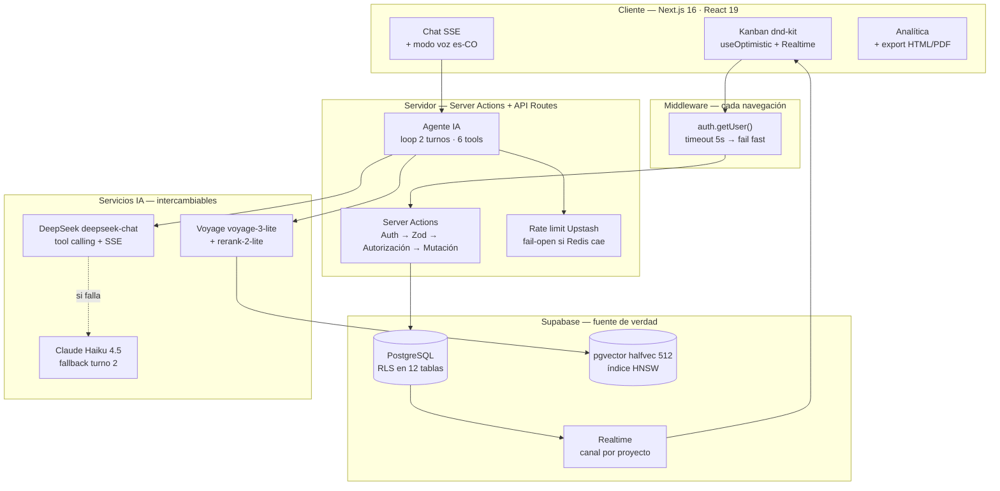
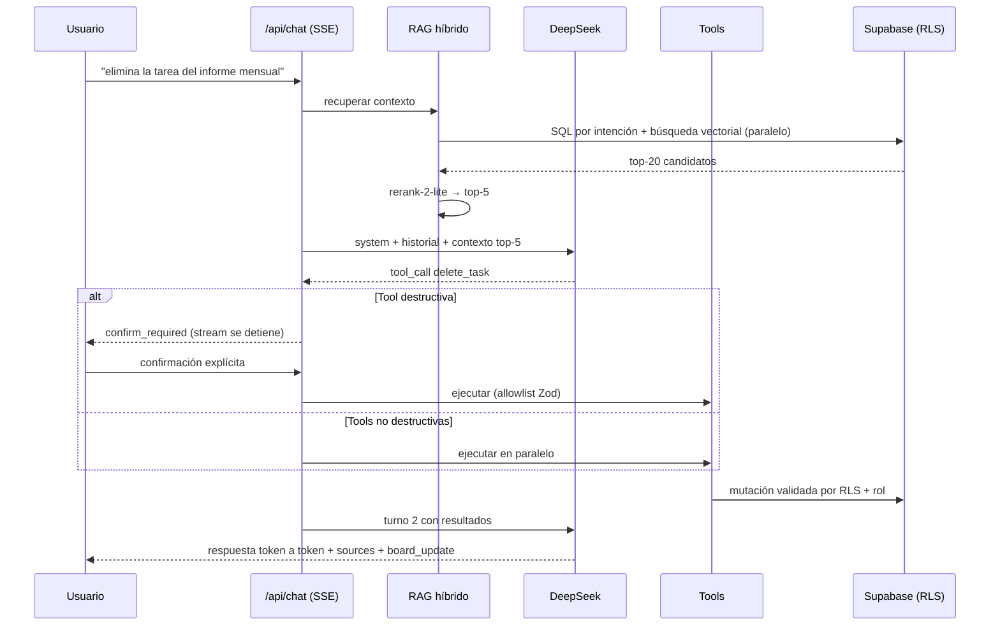
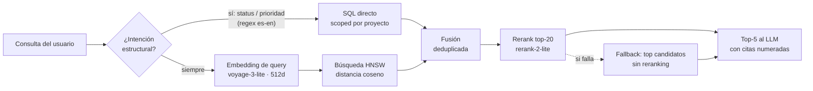

# TaskFlow v3 — Guion de Presentación Ejecutiva (12 diapositivas)

> Estilo McKinsey: cada título es un mensaje completo (action title), cada lámina cierra con un "So what".
> Estructura narrativa SCR: Situación (2–3) → Complicación (3) → Resolución (4–11) → Cierre (12).

---

## DIAPOSITIVA 1 — Portada

**Kicker:** MCOY AI + Data Strategy · Datapath Bootcamp

**Título:** TaskFlow v3: la gestión de proyectos de datos deja de ser un tablero pasivo y se convierte en un agente que ejecuta

**Subtítulo:** Plataforma SaaS multi-tenant con IA nativa — Kanban colaborativo en tiempo real, agente RAG con tool calling y analítica ejecutiva generada por LLM

**Pie:** Next.js 16 · Supabase · DeepSeek · Voyage AI · Vercel — Julio 2026

---

## DIAPOSITIVA 2 — Resumen ejecutivo

**Título:** Tres mensajes: producto completo, IA con guardrails de producción, y resiliencia probada con incidentes reales

1. **Producto completo, no prototipo.** 12 tablas con Row Level Security, 13 migraciones idempotentes, 6 herramientas de agente, CI/CD con 5 compuertas de calidad y presupuestos Lighthouse (LCP < 2.5s).
2. **La IA ejecuta, no solo conversa.** El agente crea, mueve y elimina tareas en lenguaje natural sobre un pipeline RAG híbrido (intención + vectorial + reranking); toda acción destructiva exige confirmación explícita del usuario.
3. **Operación validada bajo fuego.** Cuatro incidentes reales de producción (infraestructura eliminada, tier gratuito pausado, invitado destructivo) resueltos con patrones reutilizables — incluida una migración de proveedor LLM en ~1 hora sin tocar el parser del agente.

**So what:** el diferencial no es "usar IA", es haberla llevado a producción con seguridad, costos y fallos controlados.

---

## DIAPOSITIVA 3 — Contexto y problema

**Título:** Los equipos de datos pierden el 20–30% de su capacidad en coordinación que ninguna herramienta genérica resuelve

- **Información dispersa:** el estado real del proyecto vive en tableros, hilos de chat y hojas de cálculo que nadie reconcilia; el PM lo reconstruye a mano cada semana.
- **Reportes manuales:** los informes ejecutivos (avance, velocidad, riesgo de entrega) consumen horas de rol senior y quedan obsoletos al publicarse.
- **IA decorativa:** las suites tradicionales añaden chatbots que *describen* el tablero pero no pueden *actuar* sobre él — el usuario sigue haciendo el trabajo.
- **Multi-tenancy débil:** compartir un proyecto con roles y auditoría real (owner/editor/viewer) suele requerir un plan enterprise.

**So what:** existe espacio para una herramienta donde el tablero, el agente y el reporte comparten la misma fuente de verdad — y el agente tiene permiso de ejecutar.

---

## DIAPOSITIVA 4 — La solución

**Título:** TaskFlow v3 integra tres capacidades sobre una sola fuente de verdad: ejecutar, razonar y reportar

| Pilar | Qué hace | Evidencia |
|---|---|---|
| **Ejecución colaborativa** | Kanban drag-and-drop con updates optimistas y sincronización en tiempo real entre miembros | dnd-kit + `useOptimistic` con reversión automática; Supabase Realtime por proyecto |
| **Inteligencia accionable** | Agente conversacional que busca semánticamente y opera el tablero con 6 herramientas | Loop de 2 turnos con tool calling; streaming SSE token a token; modo voz es-CO |
| **Visibilidad ejecutiva** | Analítica de burndown/velocidad/riesgo + informe narrativo generado por LLM exportable | Métricas puras calculadas del dato real; export HTML/PDF sin dependencias de canvas |

- Onboarding de 4 pasos con proyecto demo pre-poblado; importación CSV con validación permisiva (máx. 500 filas); generación de backlog con IA con **prompt visible y editable** antes de gastar tokens.

**So what:** un solo producto cubre el ciclo completo: planear → ejecutar → preguntar → reportar.

---

## DIAPOSITIVA 5 — Arquitectura técnica

**Título:** Una arquitectura de cuatro capas donde la seguridad vive en la base de datos y la IA es un servicio intercambiable

- **Cliente:** Next.js 16 App Router + React 19; Server Components por defecto, interactividad aislada en islas cliente.
- **Middleware:** validación de sesión en cada navegación con timeout defensivo de 5s (fail fast a /login).
- **Servidor:** Server Actions con orden estricto — Autenticación → Validación Zod → Autorización → Mutación; rate limiting con fail-open.
- **Datos:** PostgreSQL con RLS en las 12 tablas + pgvector `halfvec(512)` con índice HNSW (50% menos memoria que vector estándar).
- **IA:** DeepSeek como LLM principal (API OpenAI-compatible), Claude Haiku 4.5 como fallback, Voyage AI para embeddings y reranking.

**So what:** cada capa falla de forma controlada — y ninguna clave privilegiada toca el cliente.

---

## DIAPOSITIVA 6 — El agente IA por dentro

**Título:** El agente resuelve en dos turnos: primero decide y ejecuta con herramientas, después responde con evidencia

- **Turno 1:** el LLM recibe system prompt + historial + contexto RAG y decide si responde directo o invoca herramientas (`create_task`, `update_task`, `move_task`, `delete_task`, `search_tasks`, `search_comments`). Las no destructivas se ejecutan **en paralelo**.
- **Interceptor de seguridad:** `delete_task` no se ejecuta — el stream emite `confirm_required` y se detiene hasta que el usuario confirma por un endpoint con allowlist Zod (`z.literal('delete_task')`).
- **Turno 2:** el LLM redacta la respuesta final en streaming con los resultados de las tools inyectados; el cliente recibe además `sources` (citas) y `board_update` (refresco del tablero).

**So what:** el usuario obtiene acción real con fricción cero en lo seguro — y fricción deliberada en lo irreversible.

---

## DIAPOSITIVA 7 — Pipeline RAG híbrido

**Título:** La búsqueda combina intención estructural y semántica vectorial, y un reranker decide qué merece llegar al LLM

- **Detección de intención:** regex bilingüe (es/en) identifica filtros duros — status, prioridad — y los convierte en SQL directo.
- **Búsqueda semántica:** embedding de la consulta (voyage-3-lite, 512 dims) contra índice HNSW con distancia coseno; incluye tareas de proyectos compartidos vía función `SECURITY DEFINER`.
- **Fusión + reranking:** los dos caminos se deduplican en un top-20 que `rerank-2-lite` reordena por relevancia real; solo el **top-5 con citas** llega al contexto del LLM.
- **Degradación elegante:** si el reranker falla, se usan los mejores candidatos sin reordenar — el chat nunca se queda sin contexto por un servicio auxiliar.

**So what:** precisión de búsqueda enterprise con dos APIs de bajo costo — sin infra vectorial dedicada.

---

## DIAPOSITIVA 8 — Seguridad en profundidad

**Título:** Cinco capas independientes de defensa: si una falla, la siguiente contiene el daño

| Capa | Mecanismo | Ejemplo concreto |
|---|---|---|
| **Base de datos** | RLS en las 12 tablas + funciones `SECURITY DEFINER` sin recursión | Un SELECT ajeno devuelve vacío aunque el código tenga un bug |
| **Server Actions** | Zod `.safeParse()` antes de toda query; orden Auth→Validación→Autorización→Mutación | Payloads arbitrarios rechazados antes de tocar datos |
| **Integridad** | Trigger `user_id` inmutable en tasks; `task_assignments` como asignación mutable | Ni el service_role puede robar ownership de una tarea |
| **Servicios internos** | HMAC con hash del body + ventana de 5 min en `/api/embed` | Nadie puede invocar el pipeline de embeddings sin la firma |
| **Cuenta demo** | Doble capa: la UI redirige a /register + la Server Action rechaza por email | El invitado no puede vaciar el tablero — probado tras un incidente real |

- Guardrails del agente: allowlist explícita en confirmación, prompts con reglas negativas, rate limiting por usuario (chat 20/min).

**So what:** la seguridad no depende de que la UI se comporte — el servidor y la base de datos son la línea real.

---

## DIAPOSITIVA 9 — Caso real: Olist para Sodimac · Mercadeo

**Título:** El caso Olist demuestra el producto con un proyecto de analítica end-to-end: 60 tareas, 5 roles y 93% de avance consultable por chat

- **Contexto:** proyecto de e-commerce analytics (dataset Olist de Kaggle) para el área de Mercadeo de Sodimac — arquitectura Medallion completa: Análisis → Bronze → Silver → Gold → ML → Reportes.
- **Equipo simulado con roles reales:** Data Engineer (14 tareas), Data Analyst (13), ML Engineer (7), Business Analyst (8), Scrum Master (18 — incluye 16 reviews semanales de sprint).
- **Dimensión:** 60 tareas · 910 horas estimadas · 6 fases · timeline feb–jul 2026 · avance del 93% a la fecha de corte.
- **IA sobre datos reales:** las 60 tareas tienen embeddings — el agente responde "¿qué tiene pendiente el ML Engineer?" o "¿cómo va la fase Gold?" con citas verificables.
- **Demo pública:** login de invitado de un clic aterriza directo en este proyecto, con acciones destructivas bloqueadas.

**So what:** no es un demo con lorem ipsum — es un backlog realista de ingeniería de datos que el agente entiende y opera.

---

## DIAPOSITIVA 10 — Calidad y delivery

**Título:** Cinco compuertas automáticas garantizan que lo que llega a producción es exactamente lo que se probó

- **Pipeline CI/CD (GitHub Actions → Vercel):** lint con 0 warnings → typecheck estricto → 124 tests unitarios con cobertura mínima 70% → build de producción → Lighthouse CI con presupuestos como error (LCP < 2.5s, CLS < 0.1).
- **Deploy prebuilt:** el artefacto que pasó CI es el que se publica — sin rebuild sorpresa en producción.
- **E2E con Playwright:** 6 specs autenticadas (dashboard, chat, analítica, agente) + proyecto `public` para validar guards sin sesión.
- **Auditoría IA post-build:** 4 blockers detectados y corregidos antes del lanzamiento (drift de migración RAG, cron bajo RLS anónimo, WITH CHECK tautológico, confirm endpoint sin allowlist).
- **Observabilidad:** Sentry con eventos custom (`task.created`, `agent.tool_called`, `chat.completion`) sin fugas de datos personales.

**So what:** la velocidad de entrega no se compró con deuda — se compró con automatización.

---

## DIAPOSITIVA 11 — Operación real: incidentes y patrones

**Título:** Cuatro incidentes de producción en dos semanas dejaron cuatro patrones de resiliencia hoy codificados en el producto

| Incidente real | Impacto | Patrón resultante |
|---|---|---|
| Redis de rate-limiting **eliminado** (DNS muerto) | Chat, reportes y auditoría caían con 500 | **Fail-open:** dependencias de costos nunca son single point of failure |
| Supabase free-tier **pausado** por inactividad | "This page couldn't load" en cada retorno | **Timeout en el hot path:** 5s y fail fast — latencia ajena ≠ downtime propio |
| Primer invitado **borró el tablero demo** | Demo inutilizada para los siguientes visitantes | **Doble capa destructiva:** UI que guía + servidor que rechaza |
| Cambio de proveedor LLM requerido | Riesgo de reescritura del agente | **Abstracción OpenAI-compatible:** migración Groq→DeepSeek en ~1h, cero cambios al parser |

- Bonus técnico: migraciones ahora usan `gen_random_uuid()` nativo (la extensión `uuid-ossp` no está garantizada en proyectos nuevos) — restauración completa de base de datos en una sesión.

**So what:** el sistema ya no asume que sus dependencias viven — asume que van a morir y decide cómo degradarse.

---

## DIAPOSITIVA 12 — Cierre y siguientes pasos

**Título:** La base está en producción; el roadmap multiplica valor sobre lo construido, no lo reconstruye

**Próximos 90 días (priorizado por impacto/esfuerzo):**
1. **Restaurar rate limiting** con nueva instancia Redis (el fail-open ya protege la transición).
2. **Caché de embeddings de consulta** (TTL 1h) — reduce 30–50% las llamadas a Voyage en preguntas repetitivas.
3. **Streaming en turno 1 del agente** — primer token percibido de ~4s a <500ms.
4. **Auto-asignación de tareas generadas por IA** — los participantes del modal pasan de contexto del prompt a `task_assignments` reales.
5. **Entornos preview completos** — paridad de variables para validar PRs con datos aislados.

**Mensaje final:** TaskFlow v3 demuestra que un equipo pequeño, con decisiones de arquitectura correctas y disciplina de seguridad, puede llevar IA agéntica a producción real — con incidentes, migraciones y usuarios invitados incluidos.

**Llamado a la acción:** demo en vivo — 1 clic como invitado: el proyecto Olist completo, el agente y los reportes están esperando preguntas.

---

# Anexo — Notas para el generador de presentación

- **Formato de títulos:** cada título es la conclusión de la lámina (action title). No usar títulos genéricos tipo "Arquitectura".
- **Diagramas Mermaid:** las diapositivas 5, 6 y 7 incluyen su diagrama; renderizarlos como imagen a página completa o 60% derecha con bullets a la izquierda.
- **Paleta sugerida:** fondo oscuro (#0d1117), acento azul (#3b82f6), verde operaciones (#10b981) para la diapositiva 11, rojo (#dc2626) solo para incidentes.
- **Densidad:** máximo 5 bullets por lámina al renderizar; las tablas de las diapositivas 4, 8 y 11 van como tablas nativas, no como texto.
